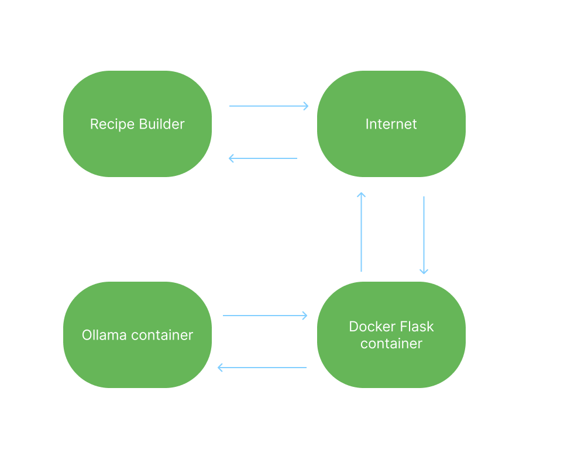

# AI-Backed Recipe Maker
An AI-powered web application that generates recipes based on ingredients provided by companies. This project leverages Flask for the backend, Ollama's API for generating AI-based recipe suggestions, and Docker for easy setup and deployment.
## Table of Contents
- [Project Overview](#project-overview)
- [Features](#features)
- [Installation and Setup](#installation-and-setup)
  - [Docker Setup](#docker-setup)
  - [Without Docker](#without-docker)
- [Directory Structure](#directory-structure)
- [Usage](#usage)
- [Unit Testing](#unit-testing)
- [Data Flow](#data-flow)
## Project Overview
This application helps companies generate recipes based on their product ingredients. The app allows users to select a company, input ingredients, and receive an AI-generated recipe using the provided ingredients, with additional suggestions.
## Features
- **Company Selection**: Choose from a list of companies to generate a recipe.
- **Ingredient Input**: Provide a list of ingredients and let the AI generate a recipe.
- **AI-Powered Suggestions**: Recipes are enhanced with extra ingredients that match the selected company.
- **Error Handling**: Graceful handling of invalid inputs and failed API calls.
- **Unit Testing**: Comprehensive tests to ensure code robustness.
  
## Installation and Setup
To run this project locally, follow these steps.
### Docker Setup
1. Clone the repository:
    ```bash
    git clone https://github.com/yourusername/recipebrowser.git
    cd recipebrowser
    ```
2. Build and run the Docker container:
    ```bash
    docker-compose up --build
    ```
3. Access the app in your browser:
    ```
    http://localhost:5000
    ```
### Without Docker
1. Clone the repository:
    ```bash
    git clone https://github.com/yourusername/recipebrowser.git
    cd recipebrowser
    ```
2. Install the required Python packages:
    ```bash
    pip install -r requirements.txt
    ```
3. Start the Flask server:
    ```bash
    python app.py
    ```
4. Access the app in your browser:
    ```
    http://localhost:5000
    ```
## Directory Structure
```bash
/project-root
  README.md         # Project README
  /RecipeBrowser
    /docs           # Documentation and diagrams
      dataflowdiagram.png
      retrospective meeting notes.md
    /src            # Main application code (Flask, Ollama API integration)
      /static       # Static files (CSS, images, etc.)
        styles.css   # CSS file for styling the webpage
      /templates     # HTML templates
        index.html
      app.py        # Main application file
      coauthortest.txt
      docker-compose # Docker setup file
      Dockerfile     # Dockerfile for building the application
      requirements.txt # Python dependencies
    /tests          # Unit tests for validating code
      test_integration
      unit_test
```
## Usage
    Select a company from the dropdown list.
    Enter the list of ingredients.
    Submit the form to generate a recipe.
    The AI will return a recipe name, tagline, and ingredients list based on your inputs.
## Unit Testing
We have set up unit tests to validate the functionality of the application. The tests cover:
- **Valid Input Handling**: Ensuring correct JSON input generates expected results.
- **Error Handling**: Ensuring malformed or missing JSON, junk data, and failed API calls are handled gracefully.
- **API Connection**: Verifying behavior when the connection to the Ollama API fails.
## Running Tests
To run the tests, execute the following command:
bash
python -m unittest discover -s tests
## Data Flow

The application’s data flow follows this process:
- **User Input**: The user selects a company and provides a list of ingredients.
- **Data Submission**: The form is submitted, sending a POST request to the /generate endpoint.
- **AI Interaction**: The Flask server forwards the user input to the Ollama API.
- **AI Response**: The Ollama API generates a recipe and returns it to the server.
- **Display**: The Flask app returns the AI-generated recipe to the user on the webpage.